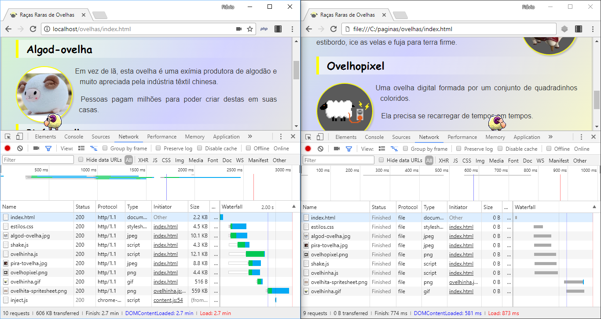
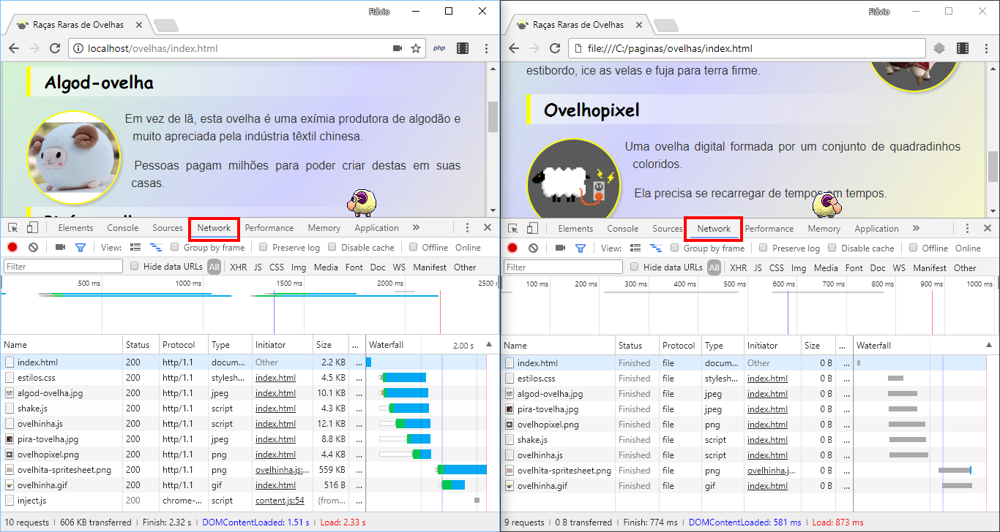
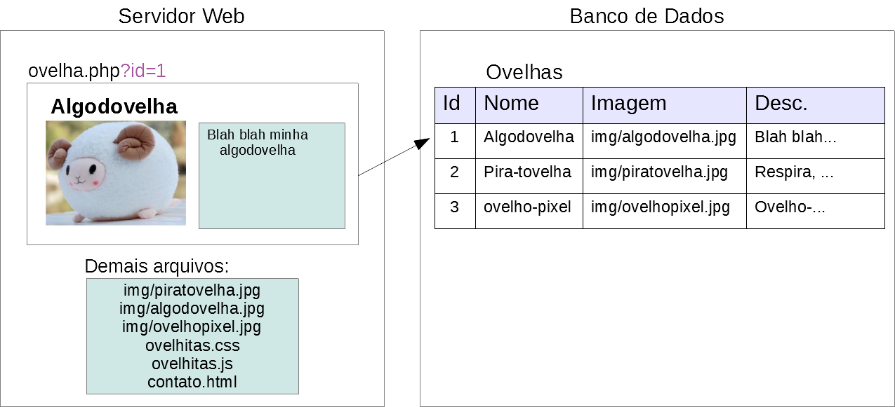

# Introdução a servidores Web
## Apache, PHP, MySQL e os piratas 
---
# O que veremos hoje

1. [O que é um servidor](#servidor-web)
<!--   - Ideia:
     1. Colocar um slide da primeira aula falando sobre servidor Web []
     1. Mostrar que, da forma como temos feito (sem servidor), a página só pode ser vista por quem tem os arquivos, no próprio computador[]
     1. Mostrar que é necessário ter um computador servindo os arquivos para quem quiser acessar. Quando uma pessoa acessa esse servidor ela está baixando esses arquivos para o próprio computador (em uma pasta temporária do navegador) [ok]
     1. Falar que esse servidor pode simplesmente entregar os arquivos (html, css, js), ou então fazer algum tipo de processamento (ie, executar um programa) que vá gerar ou alterar esses arquivos antes de entrega-los 
     1. Falar que existem vários servidores web e várias linguagens para escrever esses programas que são executados pelo servidor
-->
1. [O servidor Apache](#servidor-apache)
<!--   - Ideia:
     1. Falar que é o servidor mais usado desde que foi criado (96-97) [ok]
     1. Tem um desempenho muito bom para conseguir atender a vários computadores acessando um site ao mesmo tempo [ok]
     1. Tem suporte a várias linguagens para se escrever programas, mas a mais tradicionalmente usada é PHP [ok
     1. Funciona no linux e no windows [ok]
     1. Mostrar funcionando (eg, a animacao) de como colocar um site estático (apenas html, css, js) no Apache
-->
1. [PHP: PHP Hypertext Preprocessor](#php)
<!--   - Ideia:
     1. Falar que é uma linguagem (a mais usada em conjunto com o apache) para escrever programas no servidor para preprocessar HTML
     1. Mostrar um arquivo .php bem básico, falando que ele é um arquivo html, mas com as tags especiais <?php ?> que são onde podemos escrever o código em PHP
     1. Mostrar um exemplo de um código que, a partir de um array de *entidades* (pensar em algo que não tenha relacionamentos, mas que não seja o *tesouro* que vamos usar na prática), constrói uma tabela ou uma lista não ordenada em HTMLx	x
       - Acho que este código pode demonstrar: echo, variáveis, arrays, iteração, if/else (caso array esteja vazio, não criar a <ul></ul>)
     1. Mostrar o resultado no navegador pra verem que o arquivo index.html baixado não possui nenhuma tag PHP (porque elas foram executadas pelo Apache no atendimento à requisição)
     1. Formalizar (bem de leve) o que foi usado no exemplo: echo, variáveis, arrays, iteração, if/else
-->
1. [MySQL](#MySQL)	
<!--   - Ideia
     1. Motivar que queremos armazenar dados em um local central, que possa ser acessível a partir de qualquer lugar (eg emails do Gmail, produtos do Submarino, posts em um blog)
     1. Introduzir o conceito de SGBD, já falando que o MySQL é um bastante usado, gratuito, multiplataforma etc.
     1. Conceito de tabela como uma coleção de registros, conceito de registro, com exemplo
     1. Apresentar a linguagem SQL com alguns exemplos envolvendo SELECT, INSERT e DELETE, sem dar muitos detalhes
     1. Falar que podemos usar um banco de dados pra armazenar a lista de *entidades* e mostrar os comandos PHP para isso
-->
1. Piratas e seus Tesouros :crown: x2
<!--   1. Instalando Apache, MySQL e PHP
   1. A Atividade-->

<!--*[PHP]: PHP Hypertext Preprocessor*-->
---
<!-- {"layout": "section-header", "slideHash": "servidor-web"} -->
# Servidor Web

- Como fizemos até hoje?
- O que faz um servidor Web?
- Página estática vs página dinamica
- Servidor Apache
---

## Como fizemos até agora

- Nas práticas
	- Foram criados arquivos (html, css, etc) e, os mesmos, foram exibidos no navegador 
	- Os arquivos de um computador não podiam serem visualizados em outro 

- Para disponibilizar para demais computadores, precisamos de um serviço que:
	- **Mantenha** os arquivos
	- A partir de um **requisiçäo**, **envie** os arquivos solicitados
	- **Controle** os determinados erros que poderiam ocorrer
		- Página inexistente, falta de permissão,
- Para isso, usaremos um **servidor Web** e nos comunicaremos por meio do **protocolo HTTP**
---
::: figure .figure-slides
 <!-- {.bullet.figure-step.bullet-no-anim} -->
 <!-- {.bullet.figure-step.bullet-no-anim} -->
 <!-- {.bullet.figure-step.bullet-no-anim} -->
 <!-- {.bullet.figure-step.bullet-no-anim} -->
:::


---
## Relembrando, protocolo HTTP


- Os arquivos recebidos säo salvos, em um pasta temporária, no computador que os requisitou

---
## O que faz um servidor Web? 

- O servidor Web **precisa**:
  1. Saber falar o protocolo HTTP para atender as requisições
  1. Conhecer o sistema de arquivos do SO para entregar arquivos solicitados (JS, HTML, CSS, ...)

- O servidor Web **pode**:
  1. Executar algum arquivo
  1. Permitir a geração dinâmica de recursos (e.g., arquivos html)
  1. Permitir a recepção de arquivos (fazer _upload_)
  1. Entender outros protocolos além de HTTP: FTP, HTTPS, FTPS etc.
  1. Gerenciar conexões simultâneas de vários "solicitantes"
---
## Páginas dinamicas vs páginas estáticas
- Páginas dinamicas podem exibir um conteúdo diferente dependendo:
	- Usuário
	- Localização
	- Parametros de entrada
- Além disso, podem exibir conteúdos de um **Banco de dados** 
---
## Página Estática

---
## Páginas Dinamicas

::: figure .figure-slides
 <!-- {.bullet.figure-step.bullet-no-anim} -->
 <!-- {.bullet.figure-step.bullet-no-anim} -->
 <!-- {.bullet.figure-step.bullet-no-anim} -->
:::
---
## Servidores Web
- Exemplos de Servidores Web
	- Apache
	- Tomcat
	- JBoss
	- IIS
- Além de páginas estáticas (html, js, css), podem executar diversos tipos de linguagens:
	- PHP, Python, Java, ASP .NET


---
<!-- {"slideHash": "servidor-apache"} -->
## Apache

- Em primeiro lugar desde 1995 como o mais utilizado
- Tipicamente (mas não exclusivamente) usado associado à linguagem PHP
- Fonte do sucesso:
  1. Projeto altamente modularizado e configurável
  1. Gratuito
  1. Extensível
  1. Bom desempenho
  1. Multi-plataforma (Pode ser executado tanto no Linux quanto no Windows)


---
<!-- {"layout": "section-header", "slideHash": "php"} -->
# PHP
## Hypertext Preprocessor

- Sintaxe Básica
- Condicionais
- Estrutura de Repetição
- Vetores
---
## PHP - Hypertext Preprocessor

- Linguagem amplamente usada
- É executada **no servidor** para preprocessar e gerar HTML dinamicamente 
- O PHP é mesclado ao HTML 
- Assim, todo código PHP deve iniciar por `<?php` e finalizar com `?>`
---
## PHP - Sintaxe Básica

- echo: exibe no html o que for passado como parametro
- Exemplo: 
- Código de um arquivo `index.php`
  ```php
  <html>
    <head>
      <title>PHP Teste</title>
    </head>
    <body>
      <?php echo "<p>Olá Mundo</p>"; ?>
    </body>
  </html>
  ```
- O servidor irá ler este arquivo e enviar o seguinte HTML: 
  ```html
  <!DOCTYPE html>
  <html>
    <head>
      <title>PHP Teste</title>
    </head>
    <body>
      <p>Olá Mundo</p>
    </body>
  </html>
  ```

---
## PHP - Variáveis 
- Variáveis não precisam de ser declaradas
- Toda a variável inicia-se com o caractere `$`
- Exibir a variável no HTML: *echo*
- Para concatenação de strings, usa-se o ponto `.`
- Para que o valor da variável seja impresso, devemos colocá-la entre aspas duplas caso esteja dentro de um texto 
  ```php
	<?php
		$a = 1;
		echo $a; //imprimirá 1
		echo "resultado: $a";//imprimirá resultado: 1
		echo 'resultado: $a';//imprimirá resultado: $a
		echo "resultado: ".$a;//imprimirá resultado: 1

 	?>
  ```
---
## PHP - Condicionais
- Condicionais possuem a sintaxe similar ao JavaScript
  ```php
	<?php
		$a = 1;
		$b = rand(); // rand(): retorna um número aleatório
		echo "b: $b";  
		if($a > $b){
			echo "'a' é maior que 'b'!";
		}else{
			echo "'b' é maior ou igual a 'a'!";
		}
	?>
  ```


---
## PHP - Estrutura de repetição - **for**
- Também possui a sintaxe similar ao JavaScript
  ```php
	<?php $numero = rand(2,9); ?>
	<h1>Tabuada do <?php echo($numero)?></h1>
	<ul>
	<?php
		for($i = 1; $i < 10; $i++){
			$resultado = $i * $numero;
			echo "<li>$i x $numero = $resultado</li>";
		}
	?>
	</ul>
  ```
---
## PHP - Estrutura de repetição - **while**
  ```php
	<?php $numero = rand(2,9); ?>
	<h1>Tabuada do <?php echo $numero ?></h1>
	<ul>
	<?php
		$i = 1;
		while($i < 10){
			$resultado = $i * $numero;
			echo "<li>$i x $numero = $resultado</li>";
			$i++;		
		}
	?>
	</ul>
  ```
---
## PHP - Vetores (_Arrays_)
- Inicialização: 
 ```php
	<?php $frutas =  array("kiwi","morango","uva");?>
  ```
- Percorrendo o _array_: 
 ```php
	<?php 
		echo("<ul>");
		for($i = 0; i<count($frutas) ; $i++){
			echo("<li>{$frutas[$i]}</li>");
		}
		echo("</ul>");
	?>
  ```
	- para imprimirmos um valor do array em uma string, devemos colocá-lo entre chaves 
- A função `count` retorna o tamanho do _array_


---
## PHP - Vetores
- Arrays PHP são, na verdade, *mapas ordenados*:
	- mapeiam uma *chave* a um *valor*
- Exemplo: 
 ```php
	<?php 
		$personagem = array(nome=>"luke",
				    pontos=>123);
		
		$personagem["pontos"] += 100; 
		echo("O personagem {$personagem['nome']} possui {$personagem['pontos']}");
			
	?>
  ```
---
<!-- {"layout": "section-header", "slideHash": "MySQL"} -->
# Banco de Dados

- Por que centralizar dados?
- SGBDs
- Entidades e Relacionamentos
- Tabelas e Registros
- Cláusula SELECT
- PHP e MySQL
---
## Centralizando dados
- Servidores são úteis para *centralizar dados*, para, por exemplo:
	- salvar/ler mensagens de um bate-papo;
	- apresentar/escrever e-mails;
	- exibir/escrever posts de um blog;
	- exibir e registrar compras de produtos de um site de compra.
- Para centralizar, temos que armazenar estes dados em:
	- Arquivos;
	- Banco de Dados.
- Bancos de dados armazenam os seus dados de uma forma: 
	- mais estruturada;
	- favorecendo o uso por muitos usuários.
---
## Sistema de Gerenciamento de Banco de Dados (SGBDs)

- É um conjunto de ferramentas para gerenciar um *banco de dados*
- São exemplos de SGBDs: 
	- MySQL
	- Postgres
	- Oracle
	- MS SQL Server
- Iremos usar o MySQL por ser um SGBD gratuíto, multiplataforma e bem popular


---
## Entidades e Relacionamentos

- Um banco de dados é formado um conjunto de *entidades* com *relacionamentos*
- Entidades podem ser abstratas ou concretas:
	- Pessoa, Carro, Alimento, Pedido, Transação Bancária
- Cada entidade possui **relacionamentos** com outras
	- Uma **pessoa** faz diversas **transações bancárias**
	- Um **carro** possui uma **pessoa** que é seu dono
	- Uma **pessoa** pode fazer diversos **pedidos**

---
## Tabelas e registros
- Uma entidade é representada por uma ou mais **tabelas** em um banco de dados
- Tais tabelas possuem um conjunto de **registros**


---
## SQL - Structured Query Language

- Dado que temos um conjunto de tabelas, precisamos de uma linguagem para:
	- Manipular e Pesquisar nos registros
	- Criar, alterar a estrutura das tabelas
	- Conceder e retirar permissões	
	- etc...

- Para isso, foi criado o **SQL** que é uma linguagem padrão que a maioria dos SGBDs adotam (com algumas adaptações)
- Na aula de hoje, iremos aprender a consultar uma tabela usando a cláusula **SELECT** 


---
## SQL - Cláusula **SELECT**


---
## SQL - Cláusula **SELECT** - Exemplo (1/3)
- Seleciona todas as colunas e registros da tabela `RACA_OVELHA`


---
## SQL - Cláusula **SELECT** - Exemplo (2/3)
- Seleciona o nome de todas as raças de ovelha (i.e. tabela `RACA_OVELHA`)


---
## SQL - Cláusula **SELECT** - Exemplo (3/3)
- Seleciona o nome e alimento preferido de todas as raças de ovelha (i.e. tabela `RACA_OVELHA`) em que a expectativa de vida é menor que 5 anos


---
## PHP e MySQL - Exemplo
- Para usarmos o MySQL no PHP precisamos, primeiramente, conectar ao MySQL: 
 ```php
	<?php
	  // faz a conexão com o banco de dados
	  //                    endereço    usuario  senha   nome do banco
	  $db = mysqli_connect("localhost", "root", "123456", "piratas");
	  $db->set_charset("utf8");

	  // verifica se a conexão funcionou...
	  if (!$db) {
	    // encerra a execução do script php, dando um erro
	    $descricaoErro = "Erro: não foi possível conectar ao banco de dados. ";
	    $descricaoErro = $descricaoErro . "Detalhes: " . mysqli_connect_error();
	    die($descricaoErro);
	  }
	?>
	<!DOCTYPE html>
	<html>
	<head>
		...
  ```

---
## PHP e MySQL - Exemplo (cont)
- Logo após, podemos fazer uma consulta, por exemplo, exibindo todas as raças de ovelha. 
 ```php
	<?php
	  // faz o select
	  $sql = "SELECT nome, alimento_preferido FROM raca_ovelha";
	  $result = $db->query($sql);//db é a conexao obtida
	  if($result->num_rows > 0){
		print("<ul>");
		while($linha = $result->fetch_assoc()) {
        		echo "<li>Ovelhas da raça <strong>{linha['nome']}</strong> gostam de {linha['alimento_preferido']} </li>";
    		}	  
		print("</ul>");
	  }else{
		print("<p>Não existem ovelhas cadastradas</p>");
	  }
	?>

  ```

- Note que, caso não haja raças de ovelhas cadastradas, será exibida a mensagem "Não existem raças de ovelhas cadastradas" 
---
# Referências

1. [Site do Apache](http://apache.org)
1. [Guia PHP](http://php.net/manual/pt_BR/langref.php)
2. [Guia MySQL](https://dev.mysql.com/doc/refman/5.7/)
